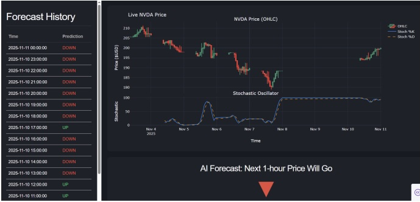
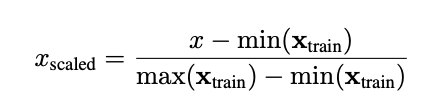
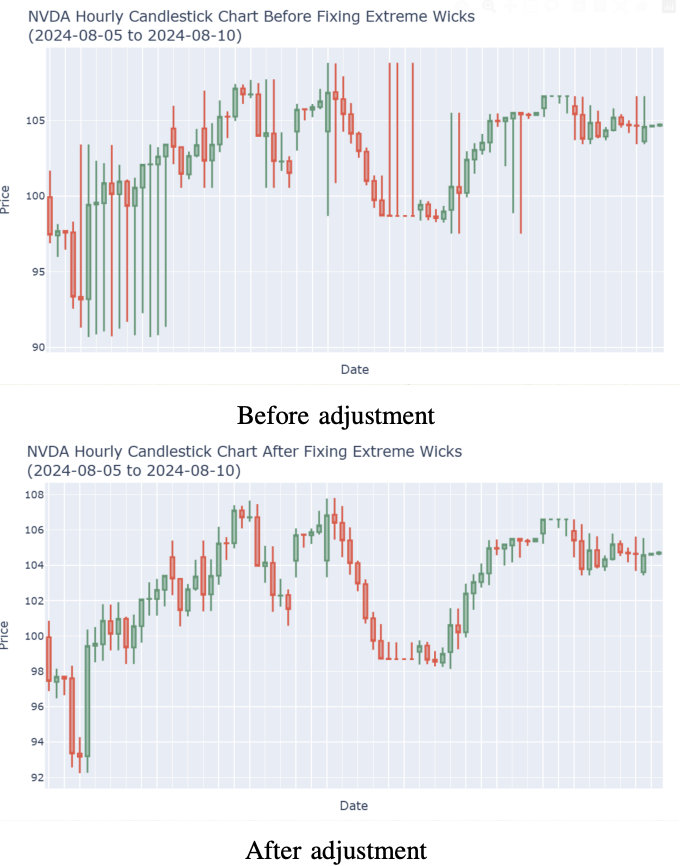
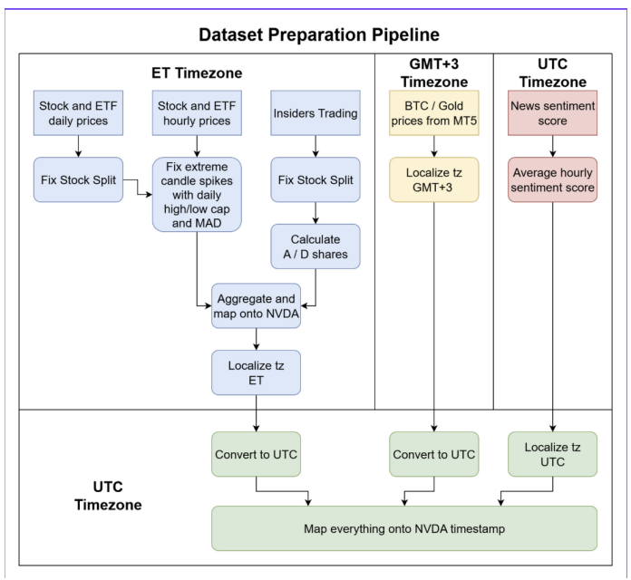
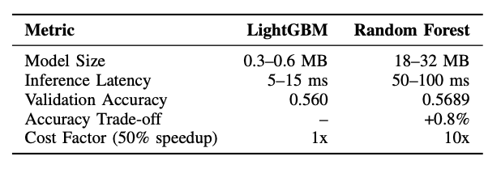

<div align="center">

# AT82.03 — Stock Trend Predictor (NVDA, Next‑Hour)

Predict **NVDA’s next‑hour direction (UP/DOWN)** from an hourly, multi‑source dataset  
(price, technicals, market context, sentiment, insiders).

 **[Project report](Documents/FINAL_REPORT_MACHINE_LEARNING_PROJECT___Q_and_friends.pdf)**

<!-- HERO: only ONE clean image row -->
<p>
  
</p>

</div>

---

## Results (from report)
| Item | Value |
|---|---:|
| Horizon | 1 hour |
| Best validation accuracy | **0.569** (Random Forest) |
| Deployment model | **LightGBM** |
| Model size | **0.3–0.6 MB** |
| Inference latency | **5–15 ms** |
| Best lookback window | **16 hours** |

---

## What matters (quick insights)
- **Price + technical indicators** are the dominant hourly signals  
- **Market context** adds marginal but measurable improvement  
- **Sentiment / insider features** contribute negligibly at the 1‑hour horizon (in this setup)

---

## Data preparation (why we clean the spikes)
Hourly OHLC can contain **extreme wicks/spikes** that distort volatility‑sensitive features.  
We correct these outliers before feature engineering.




---

## Pipeline (how data becomes an hourly dataset)
All sources are aligned onto a single **NVDA‑centric hourly timeline** (timezone normalization + aggregation).



---

## Experiments (ablation results)
We measure the marginal value of each feature group using a stepwise ablation design.



---

## Setup (dev)

### Requirements
- Python 3.10+
- `uv`
- TA‑Lib (system library)

```bash
uv --version
python -c "import talib; print('TA-Lib OK')"
uv sync
```

---

## Run
```bash
uv run python src/app.py
```

or notebooks:
```bash
uv run jupyter lab
```

---

## License
AIT coursework — **AT82.03 Machine Learning** (educational/portfolio use).
